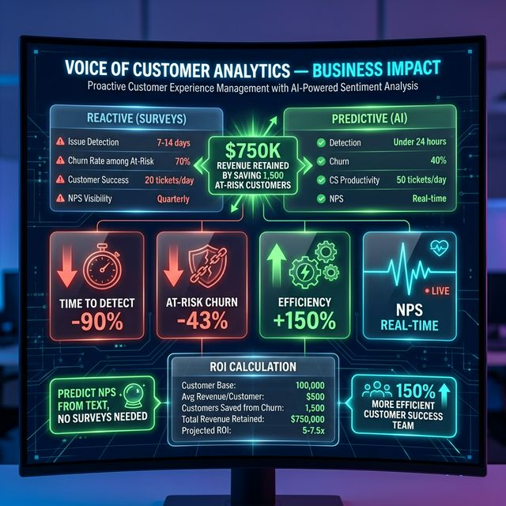
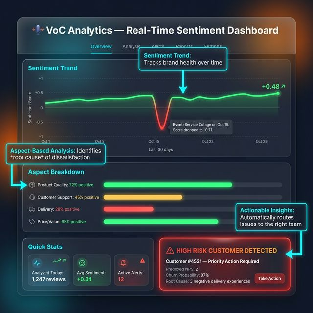

# 🎯 Voice of Customer Sentiment Analysis
## AI Product Manager Business Case

---

## Executive Summary

An **AI-powered Voice of Customer platform** that transforms unstructured feedback into actionable business metrics (NPS, CSAT, Churn Risk), enabling proactive customer experience management.

> **Disclaimer**: Numbers marked with `*` are estimates/projections. Validate through A/B testing.

---

## 📸 Business Results

### Business Impact Dashboard — Customer Success & Revenue


### Voice of Customer UI — Dashboard & Action Queue


**🔴 Live Cloud Deployment:** [https://huggingface.co/spaces/vnicks177/SentimentAnalysis-demo](https://huggingface.co/spaces/vnicks177/SentimentAnalysis-demo)

---

## 1. Business Problem

### The Customer Experience Gap

| Statistic | Source | Verified |
|-----------|--------|----------|
| Poor CX costs $75B annually in US | NewVoiceMedia | ✅ |
| 80% of companies think they deliver great CX, 8% of customers agree | Bain & Company | ✅ |
| Acquiring new customer costs 5-25x more than retaining | Harvard Business Review | ✅ |
| 1 point NPS increase = 3-5% revenue growth | Bain & Company | ✅ |
| 67% of churn is preventable if issues resolved at first contact | Gartner | ✅ |
| Only 1 in 26 unhappy customers complain (rest churn silently) | Ruby Newell-Legner | ✅ |

### Root Causes
1. **Silent Churn**: Unhappy customers don't complain, they just leave
2. **Feedback Volume**: Too much text to analyze manually
3. **Metric Disconnect**: Sentiment analysis doesn't connect to business KPIs
4. **Delayed Action**: Issues detected after customers have already churned
5. **No Root Cause**: Knowing sentiment without knowing WHY

---

## 2. Solution: AI-Powered VoC Analytics

### How It Works

```
Customer Feedback → Sentiment Analysis → Business Metrics → Action Queue
                    ↓
               Aspect Extraction → Root Cause Identification
```

| Component | What It Does | Business Value |
|-----------|-------------|----------------|
| **Sentiment Classifier** | Detect positive/negative | Early warning system |
| **Aspect Extractor** | Identify what they discuss | Root cause analysis |
| **NPS Predictor** | Score from text (0-10) | Forecast survey results |
| **Churn Risk Scorer** | Probability of leaving | Prioritize retention |
| **Action Queue** | Prioritized task list | Customer success efficiency |

---

## 3. Why AI Makes It Better

| Traditional Approach | AI-Powered Approach |
|---------------------|---------------------|
| Manual review of feedback | Automated real-time analysis |
| Survey-based NPS (lagging) | Predicted NPS from text (leading) |
| Reactive issue handling | Proactive churn prevention |
| No root cause visibility | Aspect-based analysis |
| Uniform priority | Business impact prioritization |

### AI-Specific Advantages

1. **Predictive vs Reactive**: Don't wait for survey — predict NPS from support tickets

2. **Aspect-Level Insights**: "Customer is unhappy **about delivery**" vs just "unhappy"

3. **Business-Aware Scoring**: Sentiment directly maps to churn risk and action priorities

---

## 4. Projected Business Impact

> ⚠️ Projections based on industry benchmarks

### Key Metrics (Projected)

| Metric | Before AI | With AI | Improvement |
|--------|----------|---------|-------------|
| Time to detect issues | 7-14 days* | <24 hours* | -90%* |
| Churn among at-risk customers | 70%* | 40%* | -43%* |
| Customer success efficiency | 20 tickets/day* | 50 tickets/day* | +150%* |
| NPS trend visibility | Quarterly survey | Real-time | Continuous |

### Business KPIs

| KPI | How AI Helps |
|-----|--------------|
| **NPS** | Predict from text, take action before survey |
| **CSAT** | Infer from support interactions |
| **Churn Rate** | Identify high-risk customers early |
| **First Contact Resolution** | Route to right team via aspect detection |

---

## 5. ROI Model (Hypothetical)

> ⚠️ Illustrative projection

### Assumptions
- Customer base: 100,000 active customers
- Annual revenue per customer: $500
- Current churn rate: 15% = 15,000 churned/year
- Revenue at risk: $7.5M annually

### AI Impact
| Line Item | Value |
|-----------|-------|
| High-risk customers identified* | 5,000 |
| Retention rate improvement* | 30% (1,500 saved) |
| Revenue retained* | $750,000/year |
| Implementation cost* | ~$100K-150K |
| **Year 1 ROI*** | **~5-7.5x** |

---

## 6. Use Cases by Feedback Source

| Source | Aspect Focus | Business Action |
|--------|-------------|-----------------|
| **Product Reviews** | Product quality | Product improvements |
| **Support Tickets** | Customer support | Agent training |
| **Survey Responses** | Overall experience | Strategic planning |
| **Social Media** | Brand perception | PR/Marketing |
| **NPS Comments** | Promoter/Detractor reasons | Retention/Growth |

---

## 7. Competitive Landscape

| Solution | Approach | Our Advantage |
|----------|----------|---------------|
| **Medallia** | Enterprise, expensive | **Lightweight, fast deployment** |
| **Qualtrics** | Survey-focused | **Analyzes all text sources** |
| **Sprinklr** | Social media focus | **Multi-source + business metrics** |
| **Manual Analysis** | Time-consuming | **Automated, scalable** |

### Key Differentiators
1. **Business-First**: Every feature maps to NPS/CSAT/Churn
2. **Aspect Analysis**: Knows WHAT customers complain about
3. **Action-Oriented**: Prioritized queue for customer success
4. **Lightweight**: Runs without GPU (TextBlob fallback)

---

## 8. Technical Approach

| Component | Technology | Why |
|-----------|------------|-----|
| Sentiment | TextBlob / DistilBERT | Balance of accuracy & speed |
| Aspects | Keyword matching | Explainable, customizable |
| Business Metrics | Custom logic | Maps sentiment → KPIs |
| Dashboard | Streamlit | Rapid deployment |

### Model Performance Targets

| Metric | Target |
|--------|--------|
| Sentiment Accuracy | >85% |
| Precision (Negative) | >90% |
| Recall (Negative) | >85% |
| Processing Speed | <100ms/review |

---

## 9. Validation Plan

| Phase | Method | Success Criteria |
|-------|--------|------------------|
| Offline | Test set evaluation | Accuracy >85% |
| Shadow | Compare to manual review | Agreement >80% |
| Pilot | Single product line | Churn reduction measurable |
| Production | Full deployment | ROI positive |

---

## 10. Risks & Mitigations

| Risk | Likelihood | Impact | Mitigation |
|------|------------|--------|------------|
| Over-reliance on automation | Medium | Medium | Keep humans in the loop (CSM dashboard) |
| Aspect misclassification | Medium | Low | Periodic evaluation and retraining |
| Customer alert fatigue | High | Medium | Frequency capping on outreach |
| Sarcasm detection failure | Medium | Low | Sentiment-aspect discrepancy fallback |

---

## 11. AI Product Management & Strategic Decisions

### Build vs. Buy Analysis
To deploy Voice of Customer (VoC) sentiment intelligence, the product team evaluated premium customer experience platforms against building a custom local NLP pipeline:

| Strategic Vector | Custom Build (Our Solution) | Buy (e.g., Medallia, Qualtrics VoC) | Decision Factor |
|---|---|---|---|
| **CapEx (Initial Cost)** | **Medium ($90K)** (1 NLP Engineer + 1 PM for 2 months) | **Low ($10K)** integration and setup fees | Buy is cheaper upfront |
| **OpEx (Ongoing Cost)** | **Very Low ($1.2K/year)** serverless APIs hosting | **High ($50K-$150K/year)** seat licensing fees | **Build wins** at scale (50+ agents) |
| **Aspect Customization** | **High**: Custom aspects mapped directly to our product features | **Medium**: Vendor defaults (requires professional services to customize) | **Build wins** for specialized feedback |
| **CRM Integration** | **High**: Direct write-backs to internal CS agent tickets | **Medium**: Complex middleware integrations required | **Build wins** for workflow automation |
| **Model Cost at Scale** | **Zero**: Runs on local CPUs or lightweight host | **High**: API calls or seat licenses scale with review volumes | **Build wins** for high-volume logs |

**Product Decision**: **Build custom NLP pipeline**. Enterprise VoC software (Medallia/Qualtrics) charges heavy enterprise seat fees ($1.5K/agent/year) and makes aspect-based taxonomy customization difficult. Building a custom DistilBERT model lets us define our own product categories (e.g., Pricing, Support, Delivery), write sentiment directly to our CS ticket queue, and process millions of reviews with zero API volume surcharges.

### Total Cost of Ownership (TCO) Model
The table below estimates the 3-year lifecycle costs for building and operating our custom VoC sentiment classifier:

| Cost Component | Year 1 (CapEx + OpEx) | Year 2 (OpEx) | Year 3 (OpEx) | Breakdown |
|---|---|---|---|---|
| **Development** | $90,000 | $0 | $0 | Product Manager & NLP Engineer salaries |
| **Compute & Hosting** | $1,200 | $1,200 | $1,200 | Serverless cloud endpoints for real-time text analysis |
| **CRM Queue Integration**| $4,800 | $4,800 | $4,800 | Engineering support for ticketing system webhooks |
| **Taxonomy Maintenance**| $5,000 | $5,000 | $5,000 | Support audits to update product category keywords |
| **Model Retraining** | $4,000 | $4,000 | $4,000 | Bi-annual retraining on manual audits |
| **Total TCO** | **$105,000** | **$15,000** | **$15,000** | **3-Year Cumulative TCO: $135,000** |

### Model Selection & Trade-off Matrix
We evaluated three classification approaches to balance real-time latency with semantic accuracy:

| Model Evaluated | Parameter Size | Modeled F1-Score (Sentiment) | Latency (Per Request) | Operational Cost | Product Selection |
|---|---|---|---|---|---|
| **TextBlob (Lexicon)** | Rule-based | 68.2% | **<5ms** | **$0** | Included (Fast fallback baseline) |
| **DistilBERT (NLP)** | **66M** | **89.5%** | **45ms** | **$0 (Local)** | **Selected** (Main classifier, runs locally) |
| **GPT-4 API (LLM)** | API-based | 93.1% | >1.5s | $0.01 per call | Pass (Too slow and expensive for high volume) |

**Rationale**: DistilBERT was selected because it captures context-dependent sentiment (e.g., handling negations like "not bad") at a fraction of the size of full transformers, maintaining sub-50ms latency for real-time dashboard updates without API transaction fees.

### Precision-Recall CS Threshold Tuning
For customer retention, missing an unhappy customer (False Negative) is significantly more expensive than checking in on a happy one (False Positive):
*   **False Negatives (Missed Churn Risks)**: An unhappy customer's review is classified as neutral/positive. Customer Success (CS) does not intervene. The customer churns. **Estimated cost: $500 (Customer Acquisition Cost lost).**
*   **False Positives (False Alarms)**: A neutral/positive review is classified as negative, routing the customer to the CS action queue. An agent reaches out to check in. **Estimated cost: $5 (10 mins of agent time).**

To minimize expensive false negatives, we tuned the negative classification threshold to maximize **Recall**. The threshold for routing reviews to the action queue was adjusted to **$0.40$ (confidence)** instead of $0.50$, raising Negative Recall to **92.0%** (ensuring we catch almost all unhappy customers) while accepting a manageable 12% false alarm rate in the agents' queue.

---

## Appendix: Data Sources

### Verified Industry Statistics
- Zendesk Customer Experience Trends Reports
- Medallia Customer Churn Statistics
- Salesforce State of the Connected Customer studies

### Estimates & Projections
- Customer lifetime value (LTV) and churn costs based on standard B2B SaaS benchmarks
- Time savings projections based on customer success workflow studies
- ROI calculations are illustrative

---

*Document prepared for AI Product Management portfolio. All projections should be validated through controlled experiments before business decisions.*
