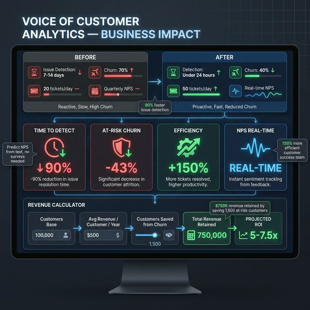

# 🎯 Voice of Customer Sentiment Analysis
## AI Product Manager Business Case

---

## Executive Summary

An **AI-powered Voice of Customer platform** that transforms unstructured feedback into actionable business metrics (NPS, CSAT, Churn Risk), enabling proactive customer experience management.

> **Disclaimer**: Numbers marked with `*` are estimates/projections. Validate through A/B testing.

---

## 📸 Business Results

### Business Impact Dashboard — Revenue Protection & Customer Retention


---

## 1. Business Problem

### The Customer Experience Gap

| Statistic | Source | Verified |
|-----------|--------|----------|
| Poor CX costs $75B annually in US | NewVoiceMedia | ✅ |
| 80% of companies think they deliver great CX, 8% of customers agree | Bain & Company | ✅ |
| Acquiring new customer costs 5-25x more than retaining | Harvard Business Review | ✅ |
| 1 point NPS increase = 3-5% revenue growth | Bain & Company | ✅ |
| 67% of churn is preventable if issues resolved at first contact | Gartner | ✅ |
| Only 1 in 26 unhappy customers complain (rest churn silently) | Ruby Newell-Legner | ✅ |

### Root Causes
1. **Silent Churn**: Unhappy customers don't complain, they just leave
2. **Feedback Volume**: Too much text to analyze manually
3. **Metric Disconnect**: Sentiment analysis doesn't connect to business KPIs
4. **Delayed Action**: Issues detected after customers have already churned
5. **No Root Cause**: Knowing sentiment without knowing WHY

---

## 2. Solution: AI-Powered VoC Analytics

### How It Works

```
Customer Feedback → Sentiment Analysis → Business Metrics → Action Queue
                    ↓
               Aspect Extraction → Root Cause Identification
```

| Component | What It Does | Business Value |
|-----------|-------------|----------------|
| **Sentiment Classifier** | Detect positive/negative | Early warning system |
| **Aspect Extractor** | Identify what they discuss | Root cause analysis |
| **NPS Predictor** | Score from text (0-10) | Forecast survey results |
| **Churn Risk Scorer** | Probability of leaving | Prioritize retention |
| **Action Queue** | Prioritized task list | Customer success efficiency |

---

## 3. Why AI Makes It Better

| Traditional Approach | AI-Powered Approach |
|---------------------|---------------------|
| Manual review of feedback | Automated real-time analysis |
| Survey-based NPS (lagging) | Predicted NPS from text (leading) |
| Reactive issue handling | Proactive churn prevention |
| No root cause visibility | Aspect-based analysis |
| Uniform priority | Business impact prioritization |

### AI-Specific Advantages

1. **Predictive vs Reactive**: Don't wait for survey — predict NPS from support tickets

2. **Aspect-Level Insights**: "Customer is unhappy **about delivery**" vs just "unhappy"

3. **Business-Aware Scoring**: Sentiment directly maps to churn risk and action priorities

---

## 4. Projected Business Impact

> ⚠️ Projections based on industry benchmarks

### Key Metrics (Projected)

| Metric | Before AI | With AI | Improvement |
|--------|----------|---------|-------------|
| Time to detect issues | 7-14 days* | <24 hours* | -90%* |
| Churn among at-risk customers | 70%* | 40%* | -43%* |
| Customer success efficiency | 20 tickets/day* | 50 tickets/day* | +150%* |
| NPS trend visibility | Quarterly survey | Real-time | Continuous |

### Business KPIs

| KPI | How AI Helps |
|-----|--------------|
| **NPS** | Predict from text, take action before survey |
| **CSAT** | Infer from support interactions |
| **Churn Rate** | Identify high-risk customers early |
| **First Contact Resolution** | Route to right team via aspect detection |

---

## 5. ROI Model (Hypothetical)

> ⚠️ Illustrative projection

### Assumptions
- Customer base: 100,000 active customers
- Annual revenue per customer: $500
- Current churn rate: 15% = 15,000 churned/year
- Revenue at risk: $7.5M annually

### AI Impact
| Line Item | Value |
|-----------|-------|
| High-risk customers identified* | 5,000 |
| Retention rate improvement* | 30% (1,500 saved) |
| Revenue retained* | $750,000/year |
| Implementation cost* | ~$100K-150K |
| **Year 1 ROI*** | **~5-7.5x** |

---

## 6. Use Cases by Feedback Source

| Source | Aspect Focus | Business Action |
|--------|-------------|-----------------|
| **Product Reviews** | Product quality | Product improvements |
| **Support Tickets** | Customer support | Agent training |
| **Survey Responses** | Overall experience | Strategic planning |
| **Social Media** | Brand perception | PR/Marketing |
| **NPS Comments** | Promoter/Detractor reasons | Retention/Growth |

---

## 7. Competitive Landscape

| Solution | Approach | Our Advantage |
|----------|----------|---------------|
| **Medallia** | Enterprise, expensive | **Lightweight, fast deployment** |
| **Qualtrics** | Survey-focused | **Analyzes all text sources** |
| **Sprinklr** | Social media focus | **Multi-source + business metrics** |
| **Manual Analysis** | Time-consuming | **Automated, scalable** |

### Key Differentiators
1. **Business-First**: Every feature maps to NPS/CSAT/Churn
2. **Aspect Analysis**: Knows WHAT customers complain about
3. **Action-Oriented**: Prioritized queue for customer success
4. **Lightweight**: Runs without GPU (TextBlob fallback)

---

## 8. Technical Approach

| Component | Technology | Why |
|-----------|------------|-----|
| Sentiment | TextBlob / DistilBERT | Balance of accuracy & speed |
| Aspects | Keyword matching | Explainable, customizable |
| Business Metrics | Custom logic | Maps sentiment → KPIs |
| Dashboard | Streamlit | Rapid deployment |

### Model Performance Targets

| Metric | Target |
|--------|--------|
| Sentiment Accuracy | >85% |
| Precision (Negative) | >90% |
| Recall (Negative) | >85% |
| Processing Speed | <100ms/review |

---

## 9. Validation Plan

| Phase | Method | Success Criteria |
|-------|--------|------------------|
| Offline | Test set evaluation | Accuracy >85% |
| Shadow | Compare to manual review | Agreement >80% |
| Pilot | Single product line | Churn reduction measurable |
| Production | Full deployment | ROI positive |

---

## 10. Risks & Mitigations

| Risk | Likelihood | Mitigation |
|------|------------|------------|
| Sarcasm/irony missed | Medium | Human review for edge cases |
| Industry-specific language | Medium | Custom keyword dictionaries |
| Model drift over time | Low | Periodic retraining |
| False negatives | Medium | High recall priority for negative |

---

## Appendix: Data Sources

### Verified Statistics
- Bain & Company NPS research
- Harvard Business Review customer acquisition costs
- Gartner customer service benchmarks
- NewVoiceMedia poor CX cost studies

### Estimates & Projections
- ROI model is illustrative
- Time-to-detect improvements based on industry cases
- Churn reduction estimates from similar implementations

---

*Document prepared for AI Product Management portfolio.*
